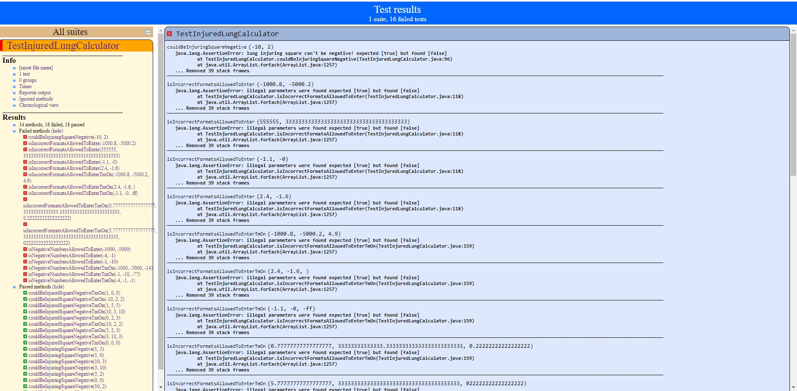
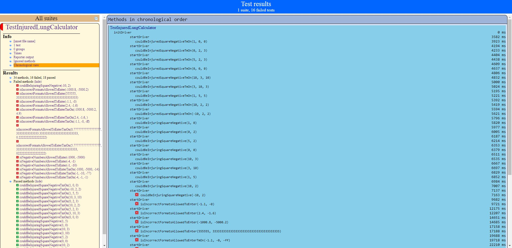
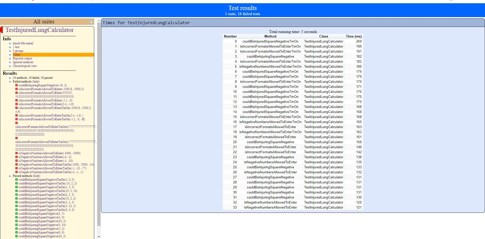
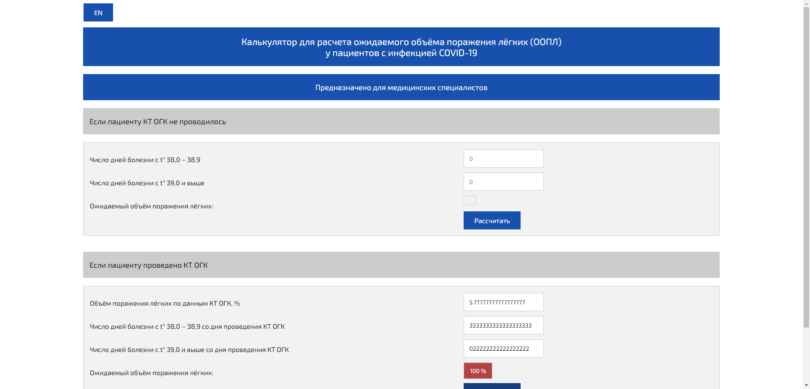
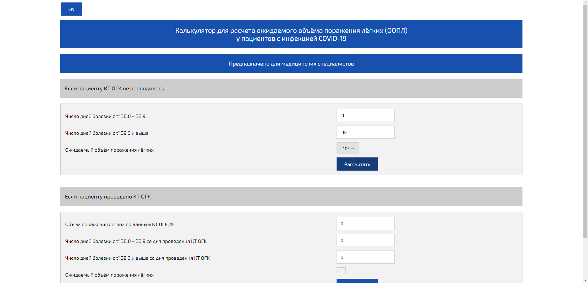
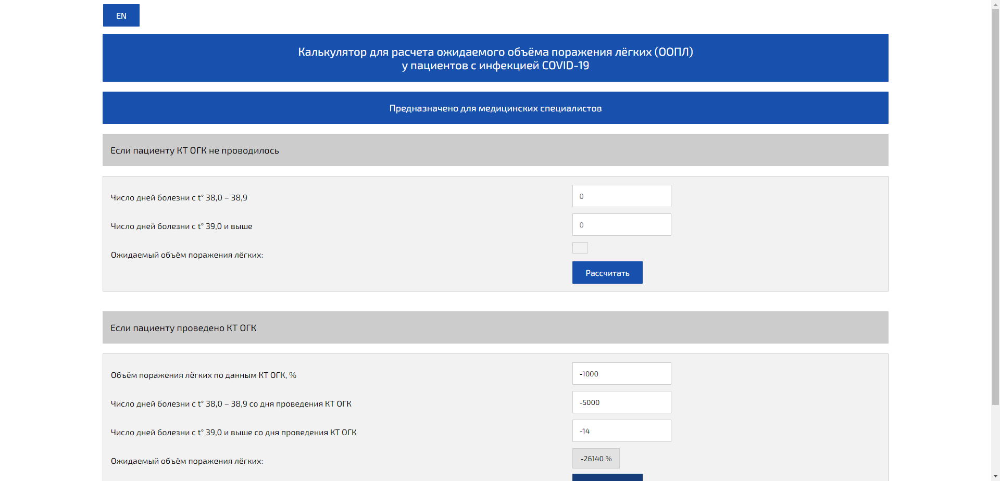

### Тестирование онлайн калькулятора по расчету ожидаемого объема поражения легких у пациентов с инфекцией COVID-19. (сайт гомельского государственного медицинского университета).
#### гомельский мед.университет https://gsmu.by/    
сам калькулятор https://gsmu.by/upload/calcForGSMU/calcGSMU.html
 
#### Краткое описание   
Фреймворк тестирования калькулятора был написан на языке **Java**, с использованием библиотек **Atlas + TestNG**.
Класс для запуска процесса тестирования располагается по данному пути [src/test/java/TestInjuredLungCalculator.java](src/test/java/TestInjuredLungCalculator.java)),   
[pom.xml](pom.xml) содержит необходимые зависимости.    
При падении тестов, создается снимок(и) экрана, сохраняющиеся в директории target/screens/
Параметры для тестирования прописаны в тестовом классе, см.аннотации
Отчет процесса тестирования, времени прохождения тестов находится в разделе target/surefire-reports/index.html
#### Скриншоты:   
* Отчет:

   
 
   
  

* Образцы скриншотов. Создаются при падении тестов в директории target/screens:   

   

   

   

   

